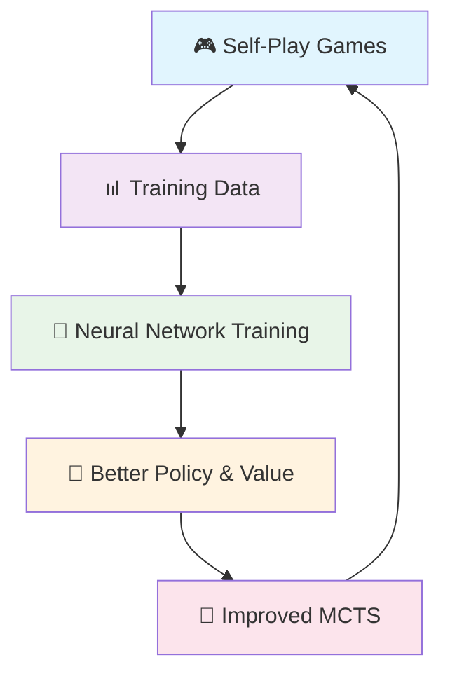

# 🎯 AlphaZero Game AI

<div align="center">


*A powerful two-player game AI inspired by DeepMind's AlphaZero*

**🚀 Self-Play Learning • 🧠 Neural MCTS • 🎮 Interactive Gaming**

</div>

---

## 📋 Overview

This repository implements a **cutting-edge game-playing agent** that combines the power of Monte-Carlo Tree Search (MCTS) with deep neural networks. Through self-play, the AI discovers optimal strategies without any human game knowledge, achieving superhuman performance through pure reinforcement learning.

### 🎯 Key Concept
> The agent plays **thousands of games against itself**, learning from each match to improve its neural network. This creates a virtuous cycle: better networks → smarter tree search → stronger gameplay → better training data → even better networks.

---

## ✨ Features

<table>
<tr>
<td width="50%">

### 🧠 **Core AI Technology**
- 🌳 **Monte-Carlo Tree Search** with neural guidance
- 🎯 **Self-Play Training** pipeline
- 📊 **Dual-headed network** (policy + value)
- 🔄 **Iterative improvement** through experience

</td>
<td width="50%">

### 🎮 **Game Support**
- 🔴 **Connect Four** (6×7 strategy game)
- 🎯 **Pre-trained models** included
- 🕹️ **Interactive Pygame interface**

</td>
</tr>
</table>

### 🚀 **Training Modes**

| Mode | 🔄 Sequential | ⚡ Parallel |
|------|---------------|-------------|
| **Memory** | Low footprint | Higher usage |
| **Speed** | Standard | GPU optimized |
| **Use Case** | Limited resources | Modern hardware |
| **Debugging** | Easier | More complex |

---

## 🎮 Games Gallery

<div>
### 🔴 Connect Four
*Complex strategy showcasing deep learning capabilities*

```
🔴🔵⚪⚪⚪⚪⚪
🔴🔵⚪⚪⚪⚪⚪
🔵🔴⚪⚪⚪⚪⚪
🔵🔴⚪⚪⚪⚪⚪
🔴🔵⚪⚪⚪⚪⚪
🔵🔴🔴🔴🔴⚪⚪
```

</div>

---


## 🧠 How It Works

<div align="center">



</div>

1. **🎮 Self-Play Generation**: AI plays against itself using MCTS + neural network
2. **📊 Data Collection**: Records positions, move probabilities, and game outcomes
3. **🧠 Network Training**: Learns to predict both move quality and position value
4. **🔄 Iterative Improvement**: Better network → stronger MCTS → better self-play

---

## 🏗️ Architecture

<div >

### 🧠 Dual-Headed Neural Network
The neural network takes game board positions as input and outputs:
- **Policy head**: Probability distribution over legal moves
- **Value head**: Expected game outcome from current position

This dual-headed architecture allows the network to both guide move selection and evaluate positions during MCTS search.

</div>


---

## 📊 Performance Benchmarks

<div align="center">

### 🏆 **Model Achievements**

| Game | 🎯 Optimal Play | 🤖 vs Random | 👤 vs Human |
|------|----------------|---------------|-------------|
| **🔴 Connect Four** | 🎯 Near-optimal | >95% win rate | Beats intermediate players |

</div>

---

## 🛠️ Dependencies

<div>

- **PyTorch** (`torch`) - Neural network training and inference
- **NumPy** (`numpy`) - Numerical computations
- **Matplotlib** (`matplotlib`) - Training visualization and plotting
- **tqdm** - Progress bars for training loops
- **Pygame** - Interactive Connect Four interface
- **Standard libraries**: `sys`, `math`, `random`

</div>

```bash
pip install torch numpy matplotlib pygame tqdm
```

---

## 🤝 Contributing

<div align="center">

**Contributions are welcome! 🎉**

| Area | Description |
|------|-------------|
| 🎮 **New Games** | Add chess, checkers, or other games |
| ⚡ **Optimization** | Improve training speed and efficiency |
| 📊 **Visualization** | Enhanced monitoring and analysis tools| 
| 🌐 **Interface** | Web or mobile interfaces |

</div>

### 📝 **Quick Contribution Guide**
1. 🍴 Fork the repository
2. 🌿 Create a feature branch
3. 💻 Make your changes
4. ✅ Add tests
5. 📤 Submit a pull request

---

## 🙏 Acknowledgments

<div align="center">

**Inspired by groundbreaking research:**

📚 [AlphaGo Paper](https://www.nature.com/articles/nature16961) - *Mastering the game of Go with deep neural networks and tree search*

📚 [AlphaZero Paper](https://arxiv.org/abs/1712.01815) - *Mastering Chess and Shogi by Self-Play with a General Reinforcement Learning Algorithm*

</div>

---

<div align="center">

**⭐ Star this repo if you found it helpful!**


</div>